# VDC Screen Editor 2
Commodore 128 80-column screen editor, version 2.

## Contents

[Version history and download](#version-history-and-download)

[Building from source](#building-from-source)

[Introduction](#introduction)

[Start program](#start-program)

[Main mode](#main-mode)

[Statusbar](#statusbar)

[Main menu](#main-menu)

[Character editor](#character-editor)

[Palette mode](#palette-mode)

[Select mode](#select-mode)

[Move mode](#move-mode)

[Line and box mode](#line-and-box-mode)

[Write mode](#write-mode)

[Color write mode](#color-write-mode)

[VDCSE2PRG utility](#vdcse2prg-utility)

[Color value reference](#color-value-reference)

[Attribute code reference](#attribute-code-reference)

[File format reference](#file-format-reference)

[Credits](#credits)


 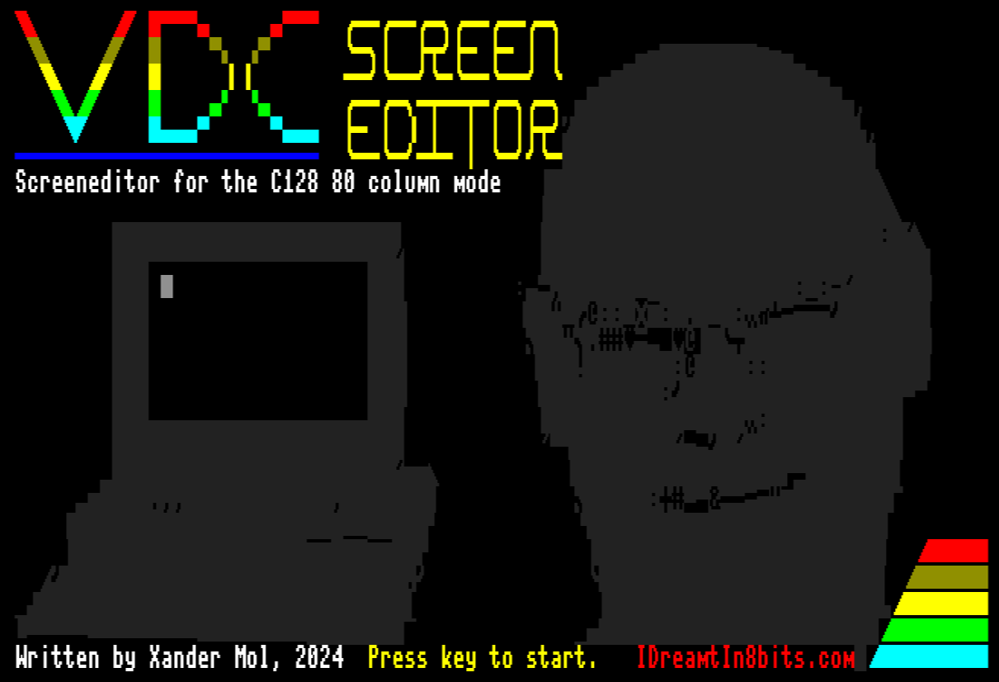

## Version history and download

[Link to latest build](https://github.com/xahmol/VDCScreenEditor2/releases/download/v21/vdcse_v21-20260603-2228.zip)

Version v21-20260603-2228:
- SEQ import/export overhaul:
    - Refactored to cleanly separate C64 and VDC SEQ modes throughout the import/export pipeline
    - Full support for Petmate 9 ESC extension sequences: underline ON/OFF (`ESC I`/`ESC J`), blink ON/OFF (`ESC O`/`ESC P`), raw VDC data marker (`ESC V`)
    - Save/restore of blink, underline, and alternate-charset plot state across nested SEQ imports so each import is independent
    - SOLVED: C64 SEQ export emitted a spurious row-break byte when canvas width was a multiple of 40, producing an empty line between every row; auto-wrap already advances the cursor so the explicit return was redundant
    - SOLVED: ESC sequence decode logic in VDC SEQ import had byte-overlap handling errors, causing incorrect character output after ESC sequences
- File browser improvements:
    - Shared `filebrowse.c`/`filebrowse.h` module extracted from `main.c` and `prg_gen.c`, removing ~1800 lines of duplication
    - SOLVED: Oscar64 §12.1 compiler limitation — `for`/`continue` constructs in `dir_readentry` translated incorrectly; rewritten as `while` loops
    - SOLVED: End-key (`e`) navigation reset `cwd.firstprinted` before the directory scan instead of after, causing incorrect display after pressing End in the file browser
    - SOLVED: File browser showing no files found and mixed upper/lower case display after the shared file browser refactor. Root cause: `filebrowse.c` is a `#pragma compile` module and does not inherit the parent compilation unit's charmap; `#include <petscii.h>` was missing so character literals did not match the uppercase PETSCII bytes returned by the IEC bus
    - SOLVED: `dir_readentry` could crash or corrupt state on malformed or too-short directory entries; added bounds checks before parsing
- Other bugfixes:
    - SOLVED: Project load did not properly restore alternate charset state — `charsetchanged[1]` was erroneously set to index `[0]` twice, so loading a project with no charsets left the alternate charset marked as unchanged
    - SOLVED: View utility (`vdcse2prgvwc`) never reloaded the alternate charset — `check_charsets` tested `view.charstd` instead of `view.charalt` as the condition for alternate charset redefinition
    - SOLVED: PRG import load-address buffer was 1 byte instead of 2, causing a buffer overrun on every PRG import
    - `sprintf` replaced with `snprintf(sizeof)` in `placesignature` to prevent buffer overflow if the version string grows
- `vdc_menu` improvements:
    - New `menu_option_select()` function to programmatically set the highlighted option before opening a menu
    - `VDC_PULLDOWN_MAXLENGTH` increased from 16 to 17 characters to give one character of slack
    - Optional compile-time border mode: define `-dVDC_MENU_BORDERS` to draw box-drawing borders around menus (off by default to stay safe when charsets are redefined)
- Makefile improvements:
    - `.env` file for Ultimate II+ target IPs (`ULTIP1`/`ULTIP2`); URL constructed in Makefile so IPs are never committed to version control
    - `check-deploy` / `check-deploy2` targets: ping the Ultimate II+ before attempting FTP upload
    - `deploy2` target for optional second machine
    - Full source dependency tracking (`MAIN_SRCS`, `GEN_SRCS`, `VIEW_SRCS`) covering all overlays and includes
    - `docs` target regenerates `README.pdf` via pandoc (warns and skips if pandoc not installed)
    - ZIP output placed in `build/` directory; `build/` created automatically in compile rules
- Documentation:
    - New `ARCHITECTURE.md`: complete memory maps, overlay system, VDC attribute layout, banking layer API, and global state table
    - New `c128vdc-seq.md`: annotated reference for the C128 VDC SEQ / Petmate 9 extended format
    - Expanded `README.md`: Building from source section with prerequisites, `.env` setup, and make target reference

Version v20-20240611-1354:
- Bugfix release:
    - SOLVED: Saving charactersets crashes the program
    - SOLVED: If placing chararcters after prefiled filename extra characters are added.

Version v20-20240421-1404:
- First release of v2 version of VDCSE
- Completely rebuild using the Oscar64 compiler (previously CC65)
- Added support for multiple VDC text screen modes, including 80x50 (ideal for C64 PETSCII art aspect ratio). NB: Needs a C128 with 64KB VDC RAM to have still also room for swap VDC memory.
- Added import and export functions: Import of both raw screen data in PRG files, or BBS Petscii code sequences in SEQ format export to SEQ format. SEQ format can be a.o. used to import from and export to other PETSCII editors like Petmate 9.
- Import functions include a VIC to VDC colour converter. Which is obviously a comprimise as VDC has only one color as alternative for the VIC pairs Orange/Brown (both convert to VDC Dark Yellow) and Light Grey/Medium Grey (both convert to VDC Light Grey), and the other colours have different hues on VDC than on VIC (for example light red from a pink like hue on VIC to red on VDC)
- Import can be done to any given coordinate in the existing project, canvas is automatically enlarged if needed to make it fit.
- VDCSE2PRG program generator now supports all screensizes that fit in memory and supports the different screenmodes. Features scrolling for sizes bigger than the screensize: smooth scrolling on 64 KB VDC RAM equiped machine and per char vertical scroll (no horizontal scroll) with 16 KB VDC. Project files can now be selected using a filebrowser.
- Many smaller refinements and bugfixes

Version v099-20220324-1527:
- Major overhaul of memory management by moving many functions to memory overlays. Gives room for new functionality (as before I did not have room left)
- Added statusbar. Is enabled by default, can be toggled to show or not by pressing F6 in every mode.
- Statusbar autohides if you move the cursor to the lowest visible line, shows again if enabled if moving up again
- Statusbar shows present mode, co-ordinates, plot screencode (visual and as hexcode), plot color (visual and as number) and shows REV UND BLI ALT if these attributes (reverse, underline, blink and alternate charset) are enabled, shows nothing if disabled. Also hints at F8 for help.
- Added Try mode: pressing T shows the present selected character as plotted without cursor blinking. Pressing space in this mode plots the character for real, any other character cancels and returns without plotting.
- Tweaked pulldown menus so that the cyan also is visible different from yellow on a monochrome monitor. Added a minus to show the actual selection to also be able to distinguish selected option without needing the colors.
- Added cancel option in all load and save dialogues by pressing ESC or STOP on devide ID or filename input
- Small change: title screen shows load progress

Version v090-20220309-1618:
- Bugfix in 'does file exist' check

Version v090-20220307-1210:
- Minor tweaks to VDCSE2PRG:
    - Show message if started in 40 column mode
    - Leave program with standard charset and clear screen (in 80 column mode)

Version 090-20220227-0036:
- Added VDCSE2PRG utility

Version 090-20220221-0920:
- Added palette mode, including visual PETSCII mode
- Added favorite slots
- Changing selected character in the character editor now also changes selected character in main mode
- Made the disk images bootable
- Other minor optimizations
- (thanks to jab / Artline Designs for hints and inspiration )

Version 090-20220103-1000:
- Bugfix for plotting not working with offsets bigger than zero

Version 090-20210922-2251:
- First released beta version

## Building from source

### Prerequisites

| Tool | Purpose | Install |
|---|---|---|
| [oscar64](https://github.com/drmortalwombat/oscar64) | C compiler targeting C128 | Build from source or download release |
| `c1541` | Disk image creation (part of VICE) | `sudo apt install vice` |
| `wput` | FTP upload to Ultimate II+ | `sudo apt install wput` |
| `pandoc` + `texlive-xetex` | Regenerate README.pdf from README.md | `sudo apt install pandoc texlive-xetex` (optional) |

The compiler is expected at `/home/xahmol/oscar64/bin/oscar64`. Edit the `CC` variable in the Makefile if yours is installed elsewhere.

### Deployment setup (.env)

Create a `.env` file in the project root to configure deployment to your Ultimate II+. This file is gitignored and will never be committed:

```ini
ULTIP1 = 192.168.1.xx       # IP of your primary Ultimate II+
# ULTIP2 = 192.168.1.yy    # optional second machine
```

The Makefile constructs the FTP path as `ftp://$(ULTIP1)/usb1/temp/`. Override `ULTUSB ?= usb1` in `.env` if your USB port is numbered differently.

### Make targets

| Target | Description |
|---|---|
| `make` / `make all` | Build all programs, disk images, and release ZIP |
| `make vdcse.prg` | Build main editor only |
| `make vdcse2prg.prg` | Build PRG generator utility only |
| `make vdcse2prgvwc.prg` | Build viewer utility only |
| `make d64` / `make d71` / `make d81` | Build specific disk image format |
| `make clean` | Remove all build artefacts |
| `make vice` | Launch VICE x128 with the D81 disk image |
| `make deploy` | Upload build to primary Ultimate II+ (requires `ULTIP1` in `.env`) |
| `make deploy2` | Upload to second Ultimate II+ (requires `ULTIP2` in `.env`) |
| `make docs` | Regenerate `README.pdf` from `README.md` (requires pandoc) |

## Introduction

VDC Screen Editor v2 is an editor to create text based screens for the Commodore 128 VDC 80 column mode. It fully supports using user defined character sets and allows the use of two 256 character character sets at the same time.

Main features of the program:
- Support for screen maps larger than the screensize of the present screenmode. Screens can be up to 30 KiB (30.720 bytes), all sizes fitting in that memory are supported. NB: As both the character data as the attribute data needs to be stored, a screen takes width times height times 2 bytes in storage. So 30k would fit up to 7 standard 80x25 screens to be distributed over width and height, so e.g. 2 screens wide and 3 screens high (160x75 characters).
- Support multiple screenmodes, including a 80x50 mode ideal for PETSCII art. Note that the largest screenmodes of 80x70 PAL or 80x60 NTSC need 64 KB VDC RAM and a monitor supporting it.
- Integrated file browser.
- Supports resizing canvas size, clear or fill the canvas
- Support for loading two user defined charsets (standard charset and alternate charset, should be standard 'C64' charsets of 256 characters of 8 bits width and 8 bits height).
- Includes a simple character editor to change characters on the fly and directly see the result in your designed screen (for editing a full character set one of the many alternatives for C64 character set editing is suggested).
- Supports all the attribute values the VDC offers, blink, underline, reverse and alternate character set. For example the reverse attribute removes the need to have a reverse copy of every character set stored in the upper 128 positions of the character set, creating more positions that can be freely used to design own graphics.
- 64KiB VDC memory only: An undo/redo system is included with up to 40 positions to go back or forward (depending on the size of the change in characters). As this uses a lot of memory, this feature is only available if 64 KiB of VDC memory is available (such as in the C128DCR).
- Write mode to freely type characters with the keyboard, supporting all printable PETSCII characters and also supporting Commodore or Control + 0-9 keys for selecting colors and RVS On/Off
- Color write mode to freely type attributes and colors
- Line and box mode for drawing lines and boxes
- Select mode to cut, copy, delete or repaint (only color or all attributes) the selection.
- Move mode to scroll the screen contents (due to memory constraints only for the 80x25 viewport)
- Import from PRG screen memory dumps and import from and export to SEQ PETSCII sequences.

## Start program

Mount the VDCSE disk image. Choose the .D64, .D71 or .D81 image depending on what is supported on the hardware or emulator you use. The program will run the same from all three images, but the .D71 and especially the .D81 will be providing faster load times and more available free storage space for your screens if you want to save your work in this same image. The disk can be mounted from any valid device ID number.

Run the program by entering RUN "VDCSE",U\<device number\> (or use other methods like JiffyDOS shortcodes or your favorite file browser). The vdcse file (with PRG file type) is the executable that should be started, the other files on the disk are supporting binaries, system fonts, title screen or help screens.

Description of contents of the disk image:

- VDCSE                     (PRG):      Main executable
- VDCSELMC                  (PRG):      Machine code routines to be loaded in low memory
- VDCSEOVL1 - VDCOVL6       (PRG):      Application code overlay files 1 to 6
- VDCSETSCR                 (PRG):      Title screen
- VDCSEHSC1                 (PRG):      Help screen for main mode
- VDCSEHSC2                 (PRG):      Help screen for character edit mode
- VDCSEHSC3                 (PRG):      Help screen for select, move and line/box modes
- VDCSEHSC4                 (PRG):      Help screen for write and color write modes
- VDCSEPETV                 (PRG):      Mapping table for visual PETSCII map
- VDCSE2PRG                 (PRG):      Executable of the VDCSE2PRG utility
- VDCSE2PRGVWC              (PRG):      Code for creating viewer
- VDCSE2PRGLMC              (PRG):      Machine code helper routines of VDCSE2PRG

All other files are supplied demo files:

*Demo project files:*
- *.proj are project meta data files. Load these to load the demo projects, including the corresponding screen and charsets.
- *.scrn are screen files part of the projects
- *.chrs are charset definition files for standard charsets of the projects
- *.chra are charset definition files for alternate charsets of the projects

*Raw PRG screen data files and SEQ BBS PETSCII data sequences for import (only on .d71 and .d81 image)*
- *raw files are demonstration raw C64 PETSCII screen files to try in the PRG importer with VIC color conversion. All files uses an offset between text en colour data of 0, apart from 'loveisthedrugraw' that uses an offset of 288 (to demonstrate it is possible to use an offset and this was the offset in memory of the original C64 demo)
- SEQ file type files: example for using the SEQ importer. VF7-V2-80X50 uses 80 by 50 dimension.

(Fun fact: all screens have actually been created using VDCSE as editor)

Leave the title screen by pressing any key.

## Main mode

After the title screen, the program starts in this mode. At start the screen shows this:

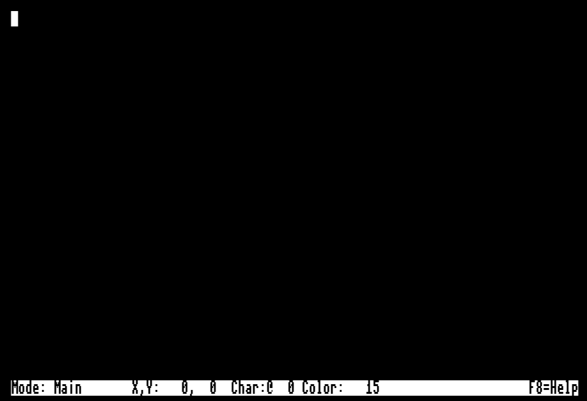

Only a blinking cursor with the presently selected [screencode](https://sta.c64.org/cbm64scr.html) and attributes is visible.

Press these keys in main mode for editing:

|Key|Description
|---|---|
|**Cursor keys**|Move cursor
|**+**|Next character (increase screen code)
|**-**|Previous character (decrease screen code)
|**0-9**|Select character from favorite slot with corresponding number
|**SHIFT + 1-9**|Store character to favorite slot with corresponding number
|**\***|Store character to favorite slot with number 0 (shift 0 does not exist)
|**,**|Previous color (decrease color number)
|**.**|Next color (increase color number)
|**SPACE**|Plot with present screen code and attributes
|**DEL**|Clear present cursor position (plot white space)
|**U**|Toggle '**U**nderline' attribute
|**B**|Toggle '**B**link' attribute
|**R**|Toggle '**R**everse' attribute
|**A**|Toggle '**A**lternate character set' attribute
|**E**|Go to 'character **E**dit mode' with present screen code
|**G**|**G**rab underlying character and attribute at cursor position
|**W**|Go to '**W**rite mode'
|**C**|Go to '**C**olor write mode'
|**L**|Go to '**L**ine and box mode'
|**M**|Go to '**M**ove mode'
|**S**|Go to '**S**elect mode'
|**P**|Go to '**P**alette mode'
|**T**|**T**ry mode
|**Z**|Undo
|**Y**|Redo
|**I**|Toggle '**I**nverse': toggle increase/decrease screencode by 128
|**HOME**|Move cursor to upper left corner of canvas
|**F1**|Go to main menu
|**F6**|Toggle statusbar visibility
|**F8**|Help screen

*Moving cursor*

Press the **cursor keys** to move the cursor around the screen. If the canvas size is bigger than the 80x25 screensize, the sreen will scroll on reaching the edges.

Pressing **HOME** will return the cursor to the upper left position.

*Selecting the [screencode](https://sta.c64.org/cbm64scr.html) to plot*

The **+** or **-** key will increase resp. decrease the selected [screencode](https://sta.c64.org/cbm64scr.html) by one. The cursor will update to the presently selected [screencode](https://sta.c64.org/cbm64scr.html).

Pressing **I** will increase the [screencode](https://sta.c64.org/cbm64scr.html) by 128 if the present [screencode](https://sta.c64.org/cbm64scr.html) is lower than 128, otherwise decrease by 128. This will emulate RVS On / RVS Off.

*Selecting the [screencode](https://sta.c64.org/cbm64scr.html) to plot from a favotite slot*

In VDCSE 10 positions are available to store your most frequently used characters in. Pressing one of the **0-9** keys selects the favorite with the corresponding number.

*Storing the present [screencode](https://sta.c64.org/cbm64scr.html) to a favorite slot*

Pressing **SHIFT** plus **1-9** stores the presently selected character to the corresponding favorite slot. As SHIFT+0 is the same as 0 on the C128, press **\*** for favorite position 0.

*Selecting the attributes to plot*

Increase or decrease the [color code](#color-value-reference) by one by pressing the **.** resp. **,** key. Pressing **U**, **B**, **R** or **A** will toggle the **U**nderline, **B**link, **R**everse or **A**lternate charset attribute.
The cursor will update to show the updated attribute code.

*Plotting and deleting a character*

Press **SPACE** to plot the presently selected character in the presently selected attributes at the present cursor position. **DEL** will delete the character and attribute value at the present position.
Press **T** to preview how the selected character would look like if plotted without cursor blinking. Then press **SPACE** to confirm plotting the character, or any other key to cancel.

*Grabbing a character*

Pressing **G** will 'grab' the character and attributes at the present cursor position and change the selected character [screencode](https://sta.c64.org/cbm64scr.html) and attribute to these values for use in all other edit functions.

*Character edit mode*

This will enter [character edit mode](#character-editor) and start with editing the presently selected [screencode](https://sta.c64.org/cbm64scr.html). Tip: if you want to edit a specific character on the screen, grab that character first by moving the cursor on that character and press **G** for grab.

*Enter edit modes*

Press **S** ([Select mode](#select-mode)) , **M** ([Move mode](#move-mode)), **L** ([Line and box mode](#line-and-box-mode)), **W** ([Write mode](#write-mode)) or **C** ([Color write mode](#color-write-mode)) for entering the corresponding edit modes.
Reference is made to the specific sections in this readme for these modes (click the links). From all modes, return to main mode by pressing **ESC** or **STOP**.

NB: No visible clue is given which mode is activated (due to constraints by not being able to take unaltered charsets for granted and the cursor already used for showing [screencode](https://sta.c64.org/cbm64scr.html) and attribute selected).

*Toggle statusbar visibility*
Press **F6** to toggle between the statusbar being visible (default) or not.

*Help screen*
Press **F8** to show a help screen with all keyboard commands for this mode.

## Statusbar
If enabled, the statusbar is plotted as this at the lowest line of the screen:


From left to right, this status bar shows:

- Mode: mode the program is in (such as Main, Select, Line/Box, Palette or Character Editor).
- X,Y: X and Y co-ordinates of the cursor (co-ordinates of the large full screen, and not only the visible screen, if a larger screen than 80 by 25 characters is selected)
- Char: the present selected character to plot, first as actual visual character, then as screencode number in hexadecimal
- Color: the present selected color to plot, first as actual visual color, then as color number
- Atrributes: this shows the enabled attributes, REV for Reverse, UND for Underline, BLI for Blink and ALT for Alternate character set. If the abbreviation is shown, the corresponding attribute is enabled, else disabled.
- Reference that F8 gives you the help screen

The status bar auto hides if the cursor is moved to the lowest visible line on the screen, and pops up again (if enabled in the first place) when the cursor moves up.

Pressing **F6** toggles statusbar visibility in every mode.

## Main menu

From [main mode](#main-mode), press **F1** to go to the main menu. The following menu will pop up:


(NB: Note that if your design uses a changed alternate character set, the program will load the standard system font and you design might temporarily look incorrect. This will be restored on exiting the main menu. Also, the colors of the main menu and the highlight colors might differ if you have chosen a non-black background color, to ensure visibility of the menus).

Navigation in this menu is performed by the following keys:

|Key|Description
|---|---|
|**Cursor LEFT / RIGHT**|Move between main menu options
|**Cursor UP/ DOWN**|Move between pulldown menu options
|**RETURN**|Select highlighted menu option
|**ESC** / **STOP**|Leave menu and go back

**_Screen menu_**

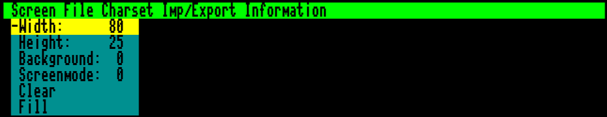

*Width: Resize width*

Resize the canvas width by entering the new width. You can both shrink as expand the width. Minimum width is 80, maximum width depends on the canvas height and the result fitting in the maximum of 30 KiB memory size allocation.

Note that with shrinking the width you might loose data, as all characters right of the new width will be lost. That is why on shrinking a pulldown menu will pop-up asking if you are sure. Select the desired answer (yellow highlighted position if using a black background).

NB: NO UNDO IS AVAILABLE FOR THIS, so if you confirm shrinking the size, all lost data is lost irretrievably.

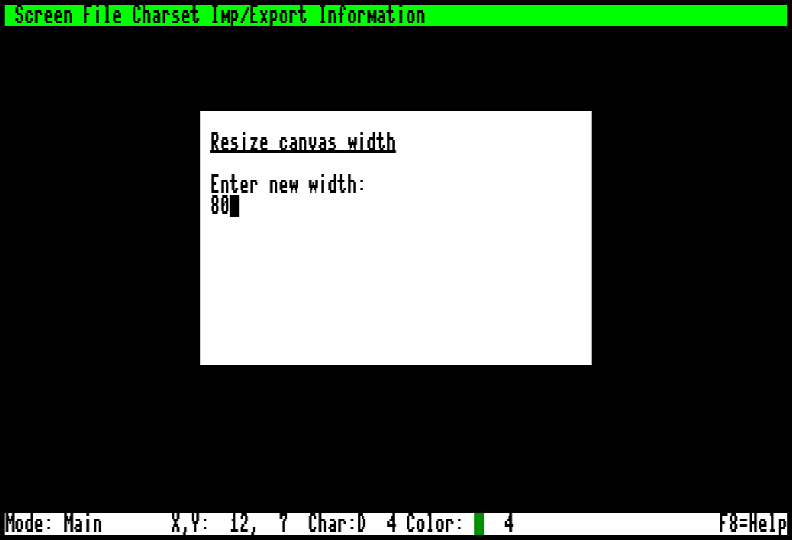

*Height: Resize height*

Similar to resize width, with this option you can resize the height in the same way. Minimum height is 25, maximum again dependent on width given maximum of 30 KiB memory allocation.

Also here: on shrinking you might loose data, which is lost if you confirm.

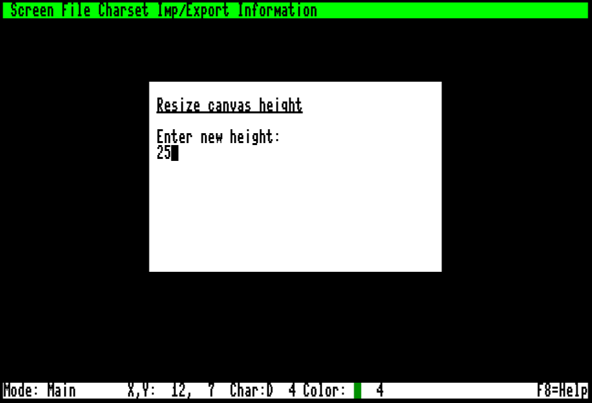

*Background: Change background color*

Select the background color. Note that if the chosen color is not black or grey, the menu and popup colors will be changed to black on colors with intensity bit on, and white on colors with intensity bit off.

The color can be selected with the **+** and **-** keys to increase resp. decrease the color value. The background color will change directly accordingly. Press **ENTER** to accept the new color, or **ESC** or **STOP** to cancel.

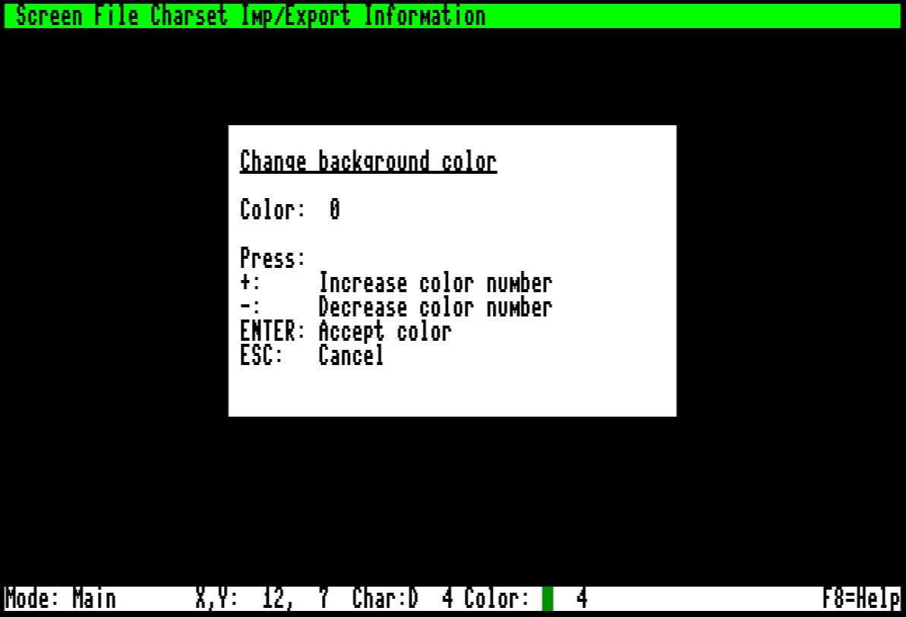

*Screenmode: Change application screen mode*

Select the screen mode. You can choose between 80x25, 80x50 and 80x70 in PAL, or 80x25, 80x50 and 80x60 for NTSC. Note that only 80x25 is supported on 16 KB VDC RAM machines, in that case selecting the other options will do nothing.

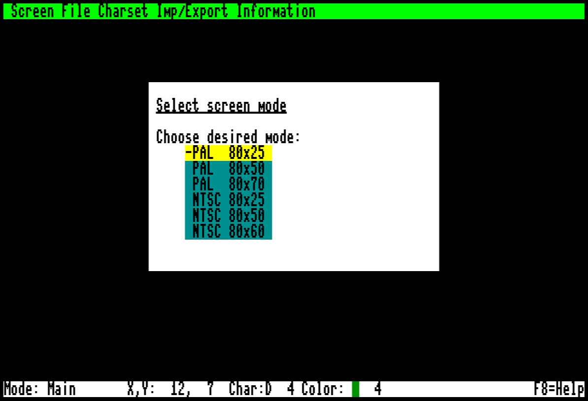

Example of the application interface in PAL 80x50:

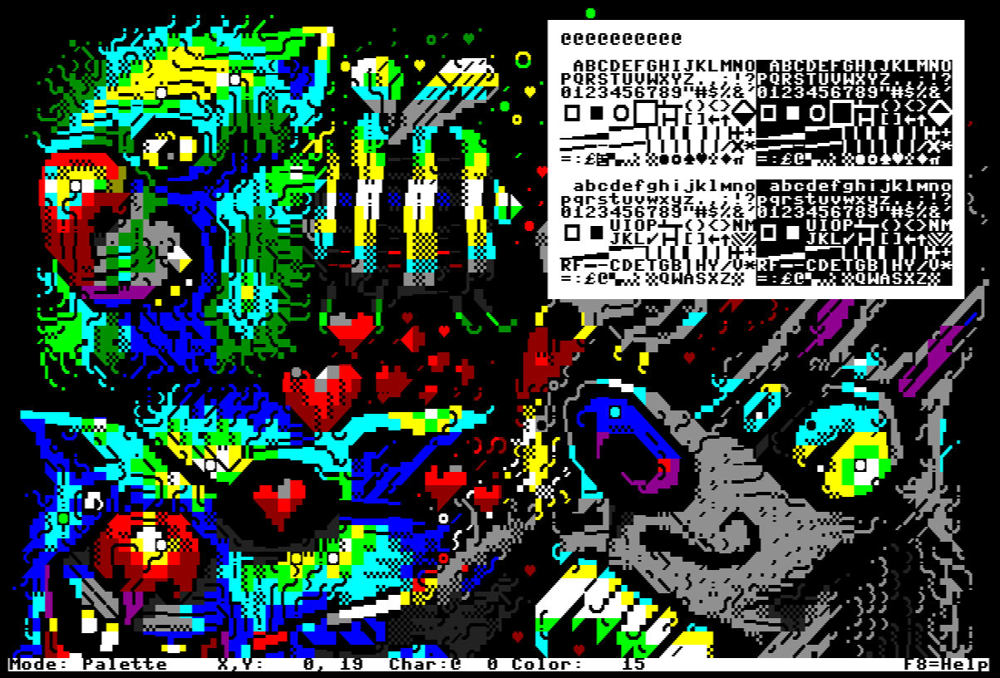

*Clear: Clear the canvas*

Selecting this menu option will clear the canvas (which means filling the canvas with spaces, with attribute code for the color white, no other attributes). No confirmation will be asked (but undo is available if 64 KiB VDC memory is present).

*Fill: Fill the canvas*

Similar to clear, but this will fill the canvas with the present selected [screencode](https://sta.c64.org/cbm64scr.html) and attributes (so the values that the cursor was showing).

**_File menu_**

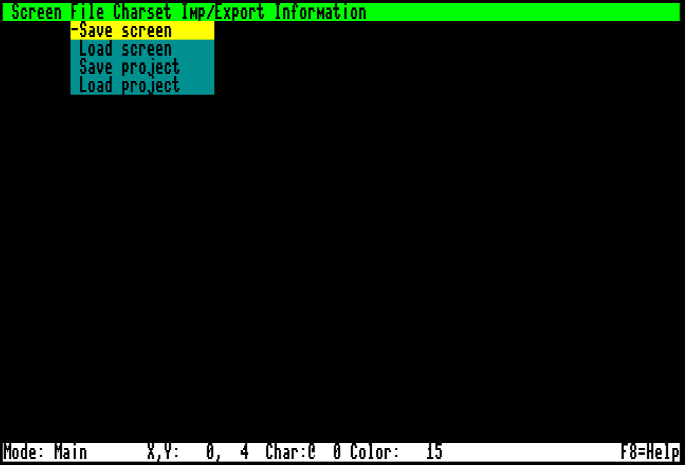

In general: pressing **ESC** or **STOP** on any devide ID or filename input dialogue cancels the file operation.

*Save screen*

This option saves the present canvas to disk.

First the device ID number is asked of the device to save to (should be between 8 and 30 and pointing to an active disk system with that ID number). Choose the ID by increasing or decreasing the ID number with the **+** or **-** keys, confirm the ID with **RETURN**.

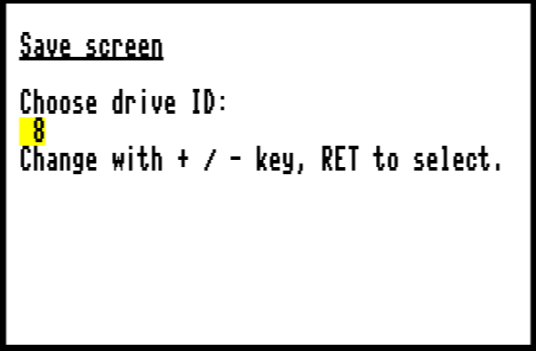

Then the filename is asked (max 15 characters in length).

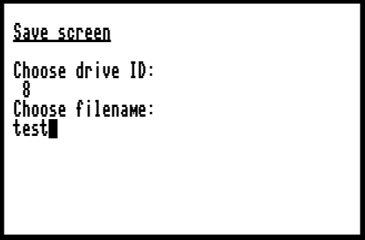

If a file with that name is already existing, confirmation is asked. Confirming will delete the old file before saving the new file.

In case of a file error, a popup will be shown with the error number.

*Load screen*

With this option you can load a screen from disk.

First pick the file to load with the file picker interface.

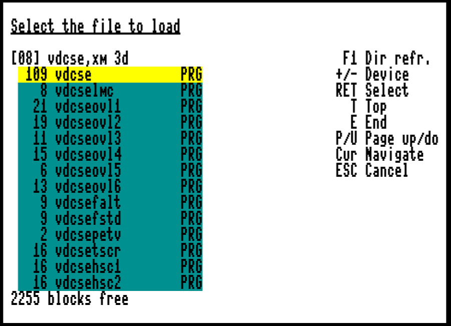

Keyboard commands in this interface:

|Key|Description
|---|---|
|**+** / **-**|Increase or Decrease the device ID to load from. Dir is refreshed on change, or shows a message for empty directories or invalid drives.
|**RETURN**|Select the highlighted file for loading
|**T**|Go to the first file in the directory
|**E**|Go to the last file in the directory
|**P**/**U**|Page down or up
|**Cursor Up / Cursor Down**|Move cursor up or down
|**ESC** / **STOP**|Cancel picking a file

After that enter the screen dimensions of the screen to load.

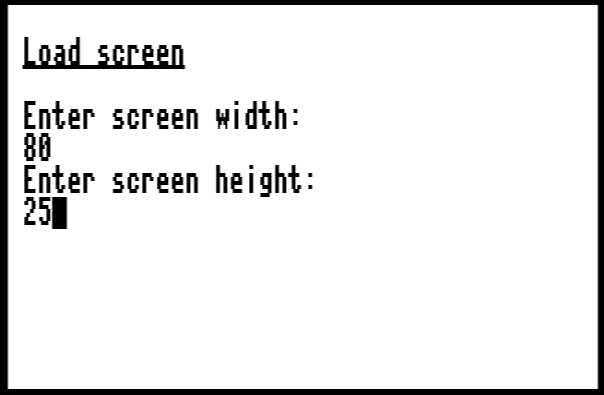

*Save project*

Similar to save screen, but with this option also the canvas metadata (width, height, present cursor position etc.) and the character sets if altered will be saved. Maximum filename length is now 10 to allow for an .xxxx suffix as it will save up to four files: filename.proj for the metadata, filename.scrn for the screen data, filename.chr1 for the standard charset and filename.chr2 for the alternate charset.

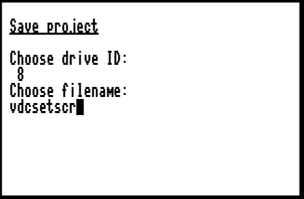

*Load project*
Loads a project: the metadata, the screen and the charsets..

As the canvas width and height is now read from the metadata, no user input on canvas size is needed. Just select the desired project file from the file picker. Only project files are shown.

**_Charset: Load, save or restore character sets_**

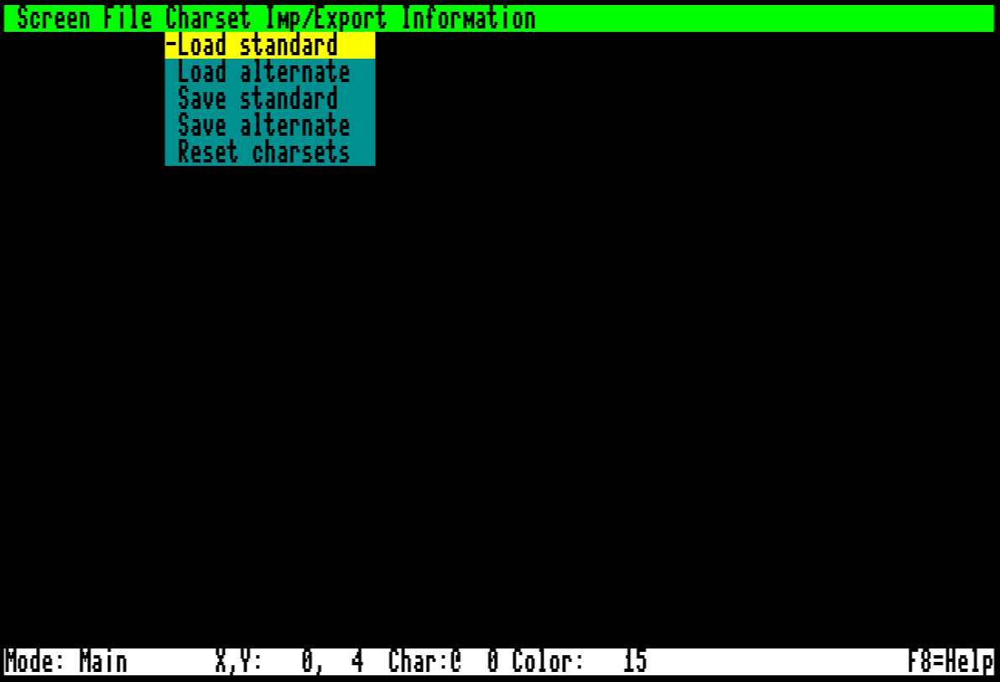

In this menu you can select the options to Load or Save character sets. Select the options standard to load or save the standard character sets, or alternate for alternate character set.
Dialogue of these options is similar to the screen save and load options: enter device ID and filename.

The menu also has the option Reset charsets. This restores the charsets to the default system ROM charsets. **NB: No undo is available, so take care on unsaved changed charsets.**

**_Imp/Export: Importing PRG and SEQ files, exporting to SEQ_**

In this menu the import and export options can be selected.

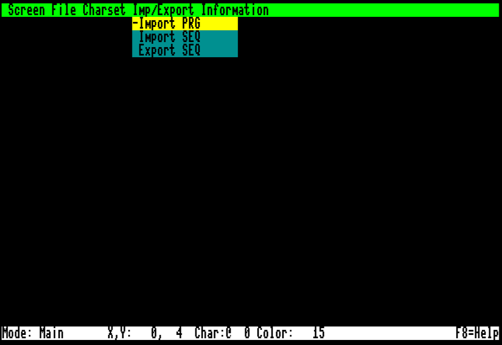

*Import PRG*

Use this option to import raw screen data from a PRG type file.

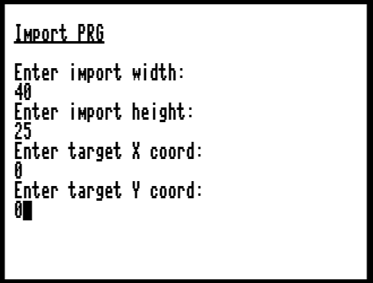

In the first screen of the Import PRG dialogue, enter the screen dimensions of the screen to be imported (width and height), plus the target co-ordinates in the present project this screen needs to be imported at. Defaults are set on the present canvas dimensions and the present cursor location.

If needed given the import screen dimensions and target co-ordinates, the canvas will be automatically enlarged to make the imported screen fit.

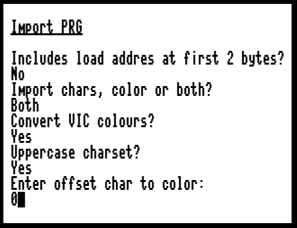

In the second screen of the Import PRG dialogue these questions are asked:

***Includes load address at first 2 bytes?***

Pick Yes or No from the pulldown menu to indicate if the file to be imported does contain a loading address in its first two bytes. If Yes is selected, the first two bytes of the file will be skipped on import.

***Include chars, colour, or both?***

Pick Both, Chars or Color for importing resp. both text and attributes from the file, only text or only attributes.

***Convert VIC colours***

Pick Yes or No from the pulldown menu to indicate ifthe colour data in the file to import is coded for VIC colours. If selected yes, the VIC coded colours will be converted to VDC colours.

**NB: The colour conversion is a comprimise** as VDC has only one color as alternative for the VIC pairs Orange/Brown (both convert to VDC Dark Yellow) and Light Grey/Medium Grey (both convert to VDC Light Grey), and the other colours have different hues on VDC than on VIC (for example light red from a pink like hue on VIC to red on VDC)

***Uppercase charset?**

In case VIC colour conversion is selected, the dialogue also asks if the imported screen is based on an uppercase or lowercase charset. Select Yes for uppercase, No for lowercase.

***Enter offset char to colour***

Enter the offset in bytes between the text and attribute data in the file to be imported. Note that only files with first text, and then attribute data are suppported.

Enter 0 if the attribute data is directly after the text data, but enter the offset if there is a gap between the two in the file.

Default is set at 48, which is the offset the VDCSE native file format uses.


After answering all questions the file is imported, a dialogue is shown to indicate progress.

Note that undo (if enabled) is supported.

*Import SEQ*

Use this option to import a PETSCII code sequence file, typically used for BBSses (or exported by tools like Petmate).

The first screen of the Import SEQ dialogue is exactly the same as for PRG import: enter the screen dimensions of the screen to be imported (width and height), plus the target co-ordinates in the present project this screen needs to be imported at. Defaults are set on the present canvas dimensions and the present cursor location.

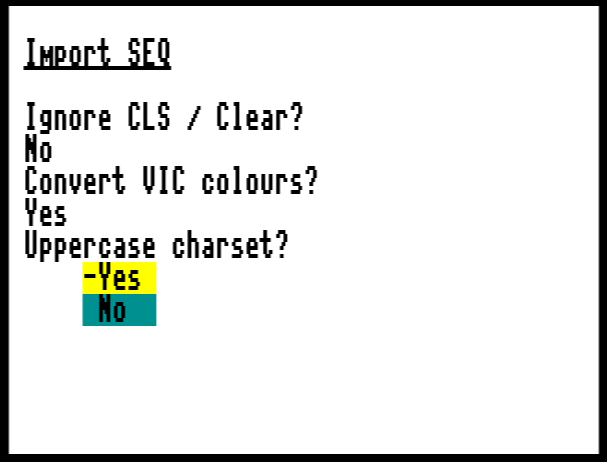


In the second screen of the Import SEQ dialogue these questions are asked:

***Ignore CLS / CLear***

Pick Yes or No from the pulldown menu to indicate if the Clear PETSCII control code should be ignored (Yes) or not. This can be handy to import the PETSCII art without clearing the area so that present art can be overplotted but existing art can remain if the BBS seqyence uses cursor movement control characters instead of spaces.

For the other two questions, Convert VIC colours and Uppercase charset, see the explanation of Import PRG.

After answering all questions the file is imported, a dialogue is shown to indicate progress.

Note that undo (if enabled) is supported.

*Export SEQ*

This option exports the present project to a BBS PETSCII codes sequence in a SEQ file. Note that VDC colour and attribute control codes are used.

Choose device ID and enter filename as explained under the Save screen option explanation of the file menu.

**_Information: Version information, exit program or toggle Undo enabled_**

Depending on the available VDC memory size two or three options are available in this menu. As the Undo system is only available if 64 KiB VDC memory size is present, the third submenu option here is only shown if 64 KiB VDC memory is detected.

*Menu with 16 KiB VDC memory:*

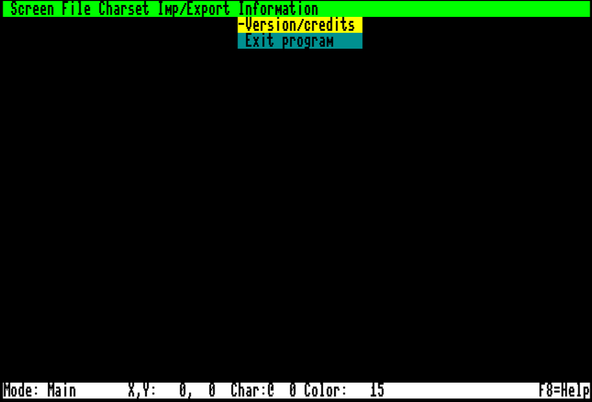

*Menu with 64 KiB VDC memory:*

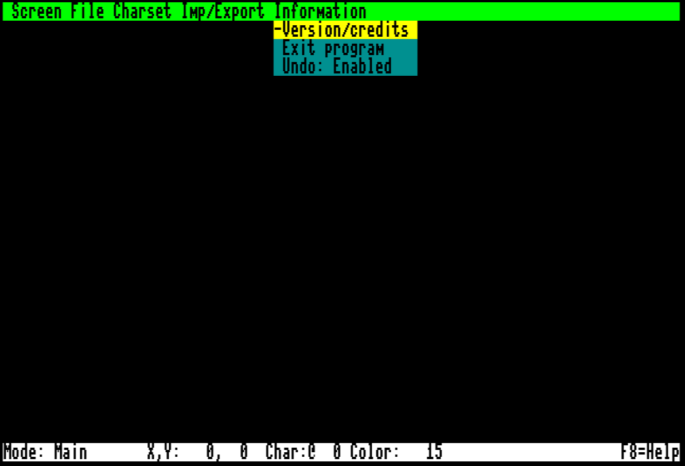

*Information*

This option shows a popup with version information.

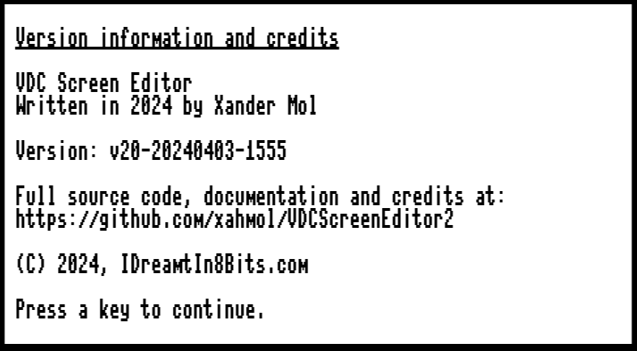

*Exit program*

With this option you can exit the program. NB: No confirmation will be asked and unsaved work will be lost.

*Undo: Enabled / Disabled  : Toggle if Undo system is active or not*

Only available if 64 KiB VDC memory is detected: This option toggles if the Undo system is enabled or not. Default is enabled, but if preferred for speed, Undo can be disabled here.

## Character editor

Pressing **E** from the main mode will result in the character editor popping up, which looks like this:

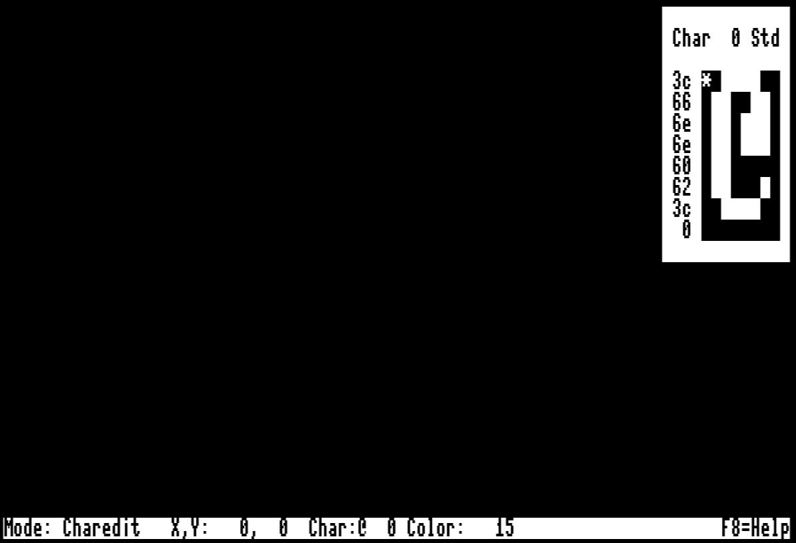

It shows a magnified grid of the bits in the present character. The header shows the screencode of the present character (in hex) and if the Standard (Std) or Alternate (Alt) character set is active. On the left of the grid the byte values of the 8 lines of the character are shown in hex.

Keyboard commands in this mode:

|Key|Description
|---|---|
|**Cursor keys**|Move cursor
|**+**|Next character (increase screen code)
|**-**|Previous character (decrease screen code)
|**0-9**|Select character from favorite slot with corresponding number
|**SHIFT + 1-9**|Store character to favorite slot with corresponding number
|**\***|Store character to favorite slot with number 0 (shift 0 does not exist)
|**SPACE**|Toggle pixel at cursor position (plot/delete pixel)
|**DEL**|Clear character (delete all pixels of present character)
|**I**|**I**nverse character
|**Z**|**U**ndo: revert present character to original state
|**S**|Re**s**tore character from system character set (=lower case system ROM charset)
|**C**|**C**opy present character
|**V**|Paste present character
|**A**|Toggle between standard and **A**lternate charset and vice versa
|**X / Y**|Mirror in **X** axis or **Y**-axis
|**O**|R**O**tate clockwise
|**L** / **R** / **U** / **D**|Scroll **L**eft, **R**ight, **U**p or **D**own
|**H**|Input **H**ex value for line at cursor position
|**ESC** / **STOP**|Leave character mode and go back to main mode
|**F6**|Toggle statusbar visibility
|**F8**|Help screen

*Moving cursor*

Press the **cursor keys** to move the cursor around the 8 by 8 grid.

*Selecting the [screencode](https://sta.c64.org/cbm64scr.html) to plot*

The **+** or **-** key will increase resp. decrease the selected [screencode](https://sta.c64.org/cbm64scr.html) by one. Pressing A will toggle the character set to be used between Standard and Alternate.

*Selecting the [screencode](https://sta.c64.org/cbm64scr.html) to plot from a favotite slot*

In VDCSE 10 positions are available to store your most frequently used characters in. Pressing one of the **0-9** keys selects the favorite with the corresponding number.

*Storing the present [screencode](https://sta.c64.org/cbm64scr.html) to a favorite slot*

Pressing **SHIFT** plus **1-9** stores the presently selected character to the corresponding favorite slot. As SHIFT+0 is the same as 0 on the C128, press **\*** for favorite position 0.

*Toggling bits in the grid*

Press **SPACE** to toggle the bit at the present cursor position. **DEL** clears all bits in the grid, **I** inverts all bits in the grid.

*Undo and restore*

**U** reverts the present character to the original values. Note that after changing to a different [screencode](https://sta.c64.org/cbm64scr.html) to edit, the previous [screencode](https://sta.c64.org/cbm64scr.html) can no longer be reverted.

**S** copies the present [screencode](https://sta.c64.org/cbm64scr.html) from the system font (which is the Alternate charset of the Commodore 128 ROM characterset, so the standard Commodore characterset in lower case).

*Copy and paste*

**C** copies the present [screencode](https://sta.c64.org/cbm64scr.html) to buffer memory to be pasted with pressing **V* at a different [screencode](https://sta.c64.org/cbm64scr.html) after selecting this other [screencode](https://sta.c64.org/cbm64scr.html).

*Mirror, rotate and scroll*

Press **X** or **Y** to mirror the grid on the X resp. Y axis. **O** rotates the grid clockwise. **L**, **R**, **U** and **D** scrolls the grid to the **L**eft, **R*ight**, **U**p or **D**own.

*Hex input*

Press **H** to edit the full present row of the grid by entering the hex value of the byte representing the bits in that byte for the line.

*Leave mode and help*

Pressing **ESC** or **STOP** leaves the character mode and returns to main mode. **F8** will show a help screen with all keyboard commands of the character mode.

## Palette mode

Pressing **P** in the main mode starts the Palette mode. In this mode a character for plotting can be selected from the full set of the two character sets and the 10 favorite slots.

A window like this appears:

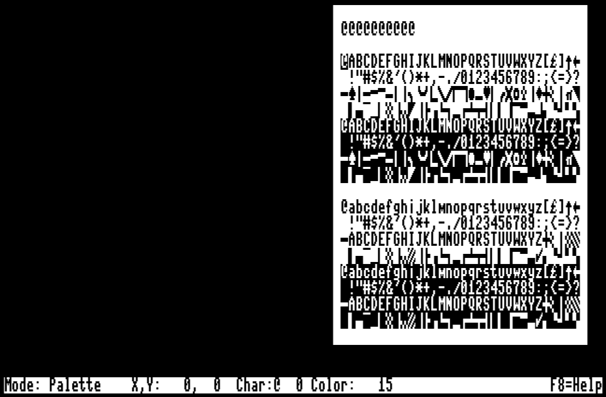

The window shows the 10 favorite slots as first line, below that the standard character set and below that the alternate character set.

Keyboard commands in this mode:

|Key|Description
|---|---|
|**Cursor keys**|Move cursor
|**SPACE or ENTER**|Select character
|**0-9**|Store character in corresponding favorite slot
|**V**|Toggle between normal mode and visual PETSCII mode
|**ESC** / **STOP**|Leave character mode and go back to main mode
|**F6**|Toggle statusbar visibility
|**F8**|Help screen

*Moving cursor*

Press the **cursor keys** to move the cursor around the grid. You can move over to the different sections by just moving out of a section to the other.

*Selecting character*

Press **SPACE** or **ENTER** to select the hightlighted characters as new character to plot with. This leaves the palette mode.

*Storing to a favorite slot*

Pessing **0-9** stores the presently highlighted character to the corresponding favorite slot.

*Toggle visual PETSCII mode*

Visual PETSCII mode is a mode in which the palette for the standard charset is mapped in such a way that PETSCII characters are ordered in a logical order for drawing. This mode makes only sense for standard charsets that left the PETSCII drawing characters unchanged.

This looks like this:

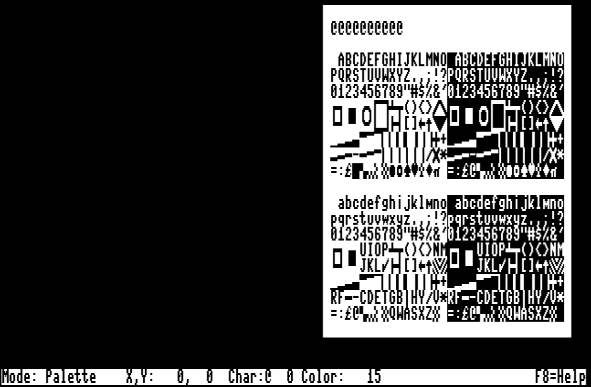

Pressing **V** toggles between normal and visual mode.

*Leave mode and help*

Pressing **ESC** or **STOP** leaves the palette mode and returns to main mode. **F8** will show a help screen with all keyboard commands of the character mode.

## Select mode

Pressing **S** in the main mode starts the Select mode.

If enabled, the statusbar shows this on entering this mode:


In this mode a selection can be made on which different operations can be performed as described below.

|Key|Description
|---|---|
|**X**|Cut: Delete selection at old position and paste at new position
|**C**|**C**opy: Copy selection at new position, leaving selection unchanged at old position
|**D**|**D**elete selection (fill with spaces)
|**A**|Paint with **A**ttribute: change attribute value of selection to present attribute value
|**P**|**P**aint with color: change only the color value of selection
|**RETURN**|Accept selection / accept new position
|**ESC** / **STOP**|Cancel and go back to main mode
|**Cursor keys**|Expand/shrink in the selected direction / Move cursor to select destination position
|**F6**|Toggle statusbar visibility
|**F8**|Help screen

*Making the selection*

Ensure that the cursor is located at the desired upper left corner of the selection to be made before entering Select mode. On entering select mode, grow the selection by pressing **Cursor Right** to increase width and **Cursor Down** to increase height. **Cursor Left** and **Cursor Up** will shrink width resp. height. This is similar to the keys used in the [Line and box mode](#line-and-box-mode).

The selection will be visually shown with plotting in the present selected screencode and attributes. It should look like this:

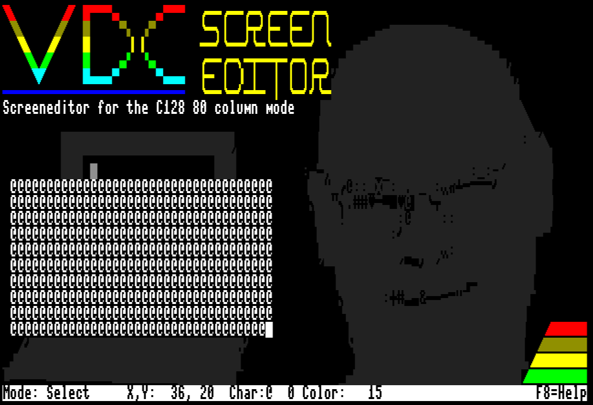

Accept the selection by pressing **RETURN**, cancel the selection by pressing **ESC**.

*Choose action to perform*

After accepting the selection, press **X**, **C**, **D**, **A** or **P** to choose an action, or press **ESC** or **STOP** to cancel.
Statusbar (if enabled) shows this as prompter:


*Cut and copy*

After pressing **X** for cut or **C** for copy, move cursor to the upper left corner where the selection should be copied to. **C** will only make a copy, **X** will delete the selection at the old location.

Statusbar (if enabled) displays Cut or Copy correspondingly, like:


*Delete*

Pressing **D** will erase the present selection (fill the selected area with spaces).

*Paint with attribute or only color*

Pressing **A** will change the attribute values of all characters in the selected area to the present selected attribute value. Pressing **P** will only change the color, but will leave the other attributes (blink, underline, reverse and alternate charset) unchanged. Note that **P** is much slower than **A**.

*Leaving mode and Help*

Leave selection mode by pressing **ESC** or **STOP**. Pressing **F8** at any time in this mode will provide a helpscreen with the key commands for this mode (not possible if the selection is grown but not yet accepted).

## Move mode

Pressing **M** in the main mode starts the Move mode. Use this mode to scroll the present viewport in the desired direction by pressing the **Cursor keys**.

Note that moving is only performed on the present 80x25 viewable part of the screen, so on larger canvas sizes not the whole screen will be moved. This is due to memory constraints.

It is also important to note that characters that 'fall off' of the screen are lost if the move is accepted.

Alternative to move mode is using [select mode](#select-mode) and use Cut to move a selection to a new position.

Accept with **RETURN**, cancel with **ESC** or **STOP**. Both will leave this mode and return to main mode.

|Key|Description
|---|---|
|**Cursor keys**|Move in the selected direction
|**RETURN**|Accept moved position
|**ESC** / **STOP**|Cancel and go back to main mode
|**F6**|Toggle statusbar visibility
|**F8**|Help screen

## Line and box mode

Pressing **L** in the main mode starts the Line and box mode. In this mode lines and boxes can be drawn, plotting with the present selected screencode and attribute value.

Ensure that the cursor is located at the desired upper left corner of the line or box to be made before entering Line and box mode. Grow the line or box by pressing **Cursor Right** to increase width and **Cursor Down** to increase height. **Cursor Left** and **Cursor Up** will shrink width resp. height. Leaving with or height at one character draws a line, otherwise a box is drawn.

Accept with **RETURN**, cancel with **ESC** or **STOP**. Both will leave this mode and return to main mode.

**F8** will show a help screen with all screen commands for this mode.

|Key|Description
|---|---|
|**Cursor keys**|Expand/shrink in the selected direction
|**RETURN**|Accept line or box
|**ESC** / **STOP**|Cancel and go back to main mode
|**F6**|Toggle statusbar visibility
|**F8**|Help screen

## Write mode

Pressing **W** in the main mode starts the Write mode. In this mode text can be freely entered by using the full keyboard, making text input way easier than selecting the appropriate screencodes one by one. The full keyboard is supported, as long as the characters entered are printable (which means: can be transferred from the input PETSCII value to a [screencode](https://sta.c64.org/cbm64scr.html). To be able to enter the full range of characters, pressing **SHIFT** or **C=** with a supported key is possible.

Additionally, selecting colors and RVS On or Off is supported using the **CONTROL** and **C=** keys while pressing the 0 to 9 keys.

Blink, Underline, Reverse and Alternate Charset attributes can be toggled by using resp. the **F1**, **F3**, **F5** or **F7** key.

Undo and redo can be performed (if enabled and if 64 KiB VDC memory is present) with **F2** for Undo and **F4** for redo.

Leave Write mode by pressing **ESC** or **STOP**. **F8** will show a help screen with the key commands for this mode.

|Key|Description
|---|---|
|**Cursor keys**|Move in the selected direction
|**DEL**|Clear present cursor position (plot white space)
|**F1**|Toggle 'blink' attribute
|**F3**|Toggle 'underline' attribute
|**F5**|Toggle 'reverse' attribute
|**F7**|Toggle '*alternate character set' attribute
|**F2**|Undo
|**F4**|Redo
|**C=** / **CONTROL** + **1-8**|Select color
|**CONTROL** + **9 / 0**|RVS On / RVS Off (toggle [screencode](https://sta.c64.org/cbm64scr.html) + 128)
|**ESC** / **STOP**|Go back to main mode
|**F6**|Toggle statusbar visibility
|**F8**|Help screen
|**Other keys**|Plot corresponding character (if printable)

## Color write mode

Pressing **C** in the main mode starts the Color write mode. In this mode you can conveniently edit colors in the screen by entering the [color value](#color-value-reference) of the desired color by pressing the key with the corresponding hex value of that color value (so **0-9** and **A-F**).

Blink, Underline, Reverse and Alternate Charset attributes can be toggled by using resp. the **F1**, **F3**, **F5** or **F7** key.

Undo and redo can be performed (if enabled and if 64 KiB VDC memory is present) with **F2** for Undo and **F4** for redo.

Leave Color write mode by pressing **ESC** or **STOP**. **F8** will show a help screen with the key commands for this mode.

|Key|Description
|---|---|
|**Cursor keys**|Move in the selected direction
|**0-9** / **A-F**|Plot color with corresponding hex number
|**F1**|Toggle 'blink' attribute
|**F3**|Toggle 'underline' attribute
|**F5**|Toggle 'reverse' attribute
|**F7**|Toggle '*alternate character set' attribute
|**F2**|Undo
|**F4**|Redo
|**ESC** / **STOP**|Go back to main mode
|**F6**|Toggle statusbar visibility
|**F8**|Help screen

## VDCSE2PRG utility

VDCSE2PRG is a separate utility to create an executable program file for the C128 of a VDCSE project. All screenmodes, redefined charsets and all screensizes are supported, only limit is that data for the screen and charsets combined must fit in 31.232 bytes (approx. 30 kilobytes).

The generated executable program supports:
- All screenmodes supoorted by VDCSE2
- All screensizes, also smaller or bigger than the screensize of the selected screenmode and redefined charsets, as long as it fits in the designated 30 kilobytes target memory
- If the screen is larger than the screensize of the selected screen mode, automated scrolling is supoorted. Note that smooth scroll in both the vertical as horizontal direction is only supoorted on 64 KB VDC RAM machines, on 16 KB VDC RAM machines only vertical per char scroll is supported.
- The generated program will detect VDC RAM size automatically and choose the proper scroll mode if needed (or exit with a message if horizontal scrolling would be needed given the screensize, while only 16 KB VDC RAM is available.)

This is a seperate utility which can not be started from the VDCSE main program but has to be started seperately by loading the VDCSE2PRG file from disk with for example RUN"VDCSE2PRG",U(device number).

Running this program first gives a filebrowser to select the VDCSE project file to base the generated program on. The browser filters to show only project files, pick the desired one using the filebrowser interface.

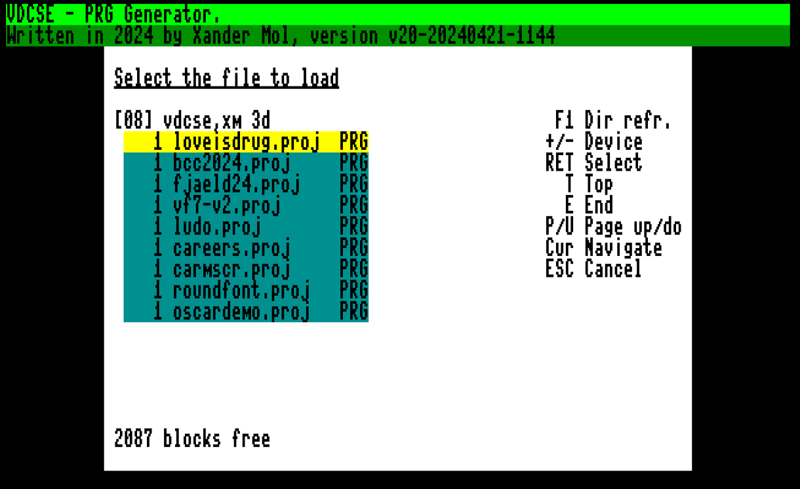

If the selected project fits in the destination memory available, next step is to enter the destination file name. If the file already does exist, confirmation is asked. NB: If Yes is chosen the old file with that name will be deleted.

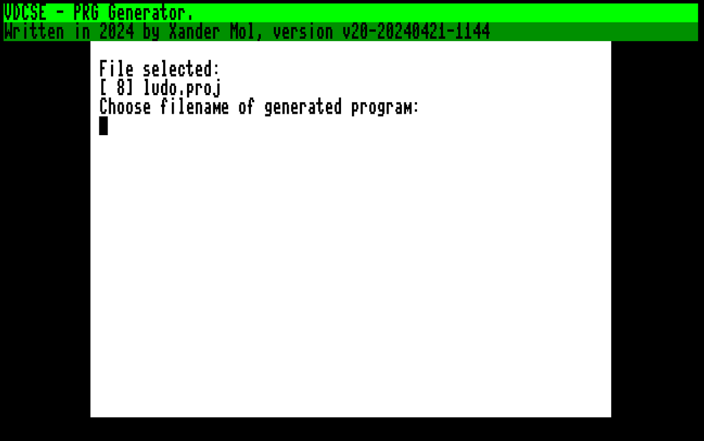

After this the ulitily will create and save the viewer program. This gives output as this:

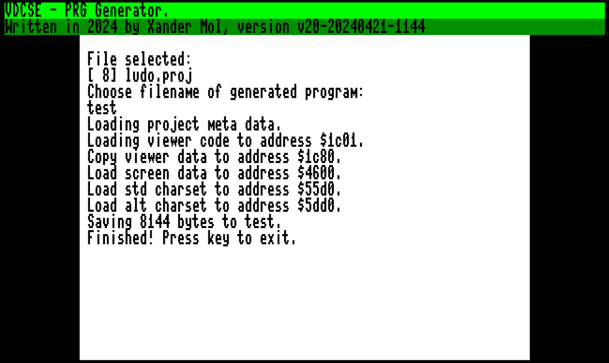

Press any key to exit the generator.

The generated program can be executed by using a RUN"(target filename)",U(target device ID).

Memory map for created program file:
$1C01-$1C0D BASIC starter for program using SYS command
$1C0D-$1C80 Compiler run time environmennt
$1C80-$1CA0 Viewer data (screenmode, size, charset addresses)
$1CA0-$4600 Viewer code and viewer heap, stack and dynamic data sections
$4600-$C000 Room for screens and charsets: first screen, then charsets if redefined (first standard, than alternate charset)

The file view.c in the src dir of this repository shows the C source code used for the Oscar64 compiler, this can also be used as base for own viewers or demos.

## Color value reference

|Color|Decimal|Color write key|Write mode key|
|---|--:|--:|---|
|Black|0|0|**CONTROL+1**
|Dark Grey|1|1|**C= + 5**
|Dark Blue|2|2|**CONTROL+7**
|Light Blue|3|3|**C= + 7**
|Dark Green|4|4|**CONTROL + 6**
|Light Green|5|5|**C= + 6**
|Dark Cyan|6|6|**C= + 4**
|Light Cyan|7|7|**CONTROL + 4**
|Dark Red|8|8|**CONTROL + 3**
|Light Red|9|9|**C= + 3**
|Dark Purple|10|A|**C= + 1**
|Light Purple|11|B|**CONTROL + 5**
|Dark Yellow|12|C|**C= + 2**
|Light Yellow|13|D|**CONTROL + 8**
|Light Grey|14|E|**C= + 8**
|White|15|F|**CONTROL+2**

## Attribute code reference

The VDC chip uses a byte per character position with the following meaning of the bits in that byte (for character mode):

|Bit|7|6|5|4|3|2|1|0|
|---|---|---|---|---|---|---|---|---|
|Meaning of bit|Alternate|Reverse|Underline|Blink|Red|Green|Blue|Intensity|

This means an attribute code is calculated like:

|Add value|Meaning|
|---|---|
|0-15|Color value 0 to 15, see [color value reference](#color-value-reference) above.
|16|Enable Blink|
|32|Enable Underline|
|64|Enable Reverse|
|128|Enable alternate character set (not enabled shows the character in the standard character set)

Example:

- Light yellow text with underline and in alternate character set: 13+32+128=173
- Darkgreen text in reverse and standard character set: 4+64=68

Note that in VDCSE calculation of these attribute codes by yourselves is not necessary, the program will do so for you given the selected attributes and color. In memory however this is how the codes are stored.

## File format reference

As both the character data as the attribute data needs to be stored, a screen takes width times height times 2 bytes in storage. A padding of 48 bytes is used to separate character and attribute data in order to be able to load a standard 80x25 screen for both character and attribute data in one go at the default VDC memory position of $0000 for text and $0800 for attributes.

For a default 80 characters wide and 25 characters high screen this would result that data would be stored as such:

|Offset to start address in bytes (decimal)|Offset in hex|Description|
|--:|--:|---|
|0|0|Start of text character data using [screen codes](https://sta.c64.org/cbm64scr.html)
|2000|07D0|Start of 48 byte padding. This is used to place a VDCSE version signature
|2048|0800|Start of attribute data using VDC [attribute codes](#attribute-code-reference).

For screensizes greater than 80x25 this would translate to:

|Offset to start address in bytes (decimal)|Description|
|--:|---|
|0|Start of text character data using [screen codes](https://sta.c64.org/cbm64scr.html)
|Width * Height|Start of 48 byte padding. This is used to place a VDCSE version signature
|(Width * Height)+48|Start of attribute data using VDC [attribute codes](#attribute-code-reference).

### c128 VDC SEQ (Petmate 9) summary

VDCSE supports the Petmate 9 extended PETSCII SEQ format used by some BBS tools and editors. A full, annotated summary is included in c128vdc-seq.md (root). Key points:

- ESC sequences are case-sensitive: ESC (0x1B) followed by an uppercase ASCII command byte.
- ESC V (0x1B 0x56): Raw-data marker — used to encode "unsafe" bytes. Follows with raw VDC character/attribute bytes.
- ESC I (0x1B 0x49) / ESC J (0x1B 0x4A): Underline ON / OFF.
- ESC O (0x1B 0x4F) / ESC P (0x1B 0x50): Blink ON / OFF.
- Petmate color indices map to SEQ bytes; VDCSE converts these indices to VDC attribute bytes (see c128vdc-seq.md for mapping and collision rules).

Notes for importers/exporters:
- Use explicit hex constants (not char literals) for ASCII command bytes to avoid accidental case/locale mismatches.
- ESC V is used when emitting bytes that would otherwise collide with control codes; importer recognizes and decodes these into raw VDC bytes.

See c128vdc-seq.md in this repository and the original PetMate 9 source for full details and examples.

## Credits

VDC Screen Editor

Screen editor for the C128 80 column mode

Written in 2024 by Xander Mol

https://github.com/xahmol/VDCScreenEditor2

https://www.idreamtin8bits.com/

Code and resources from others used:

-   Oscar64 cross compiler

    https://github.com/drmortalwombat/oscar64

    Many thanks also to https://github.com/drmortalwombat to provide extrordinary support and tips for making this and adapting Oscar64 to my needs faster than I could ask it.

-   C128 Programmers Reference Guide: For the basic VDC register routines and VDC code inspiration
    http://www.zimmers.net/anonftp/pub/cbm/manuals/c128/C128_Programmers_Reference_Guide.pdf

-   Scott Hutter - VDC Core functions inspiration:
    https://github.com/Commodore64128/vdc_gui/blob/master/src/vdc_core.c
    (used as starting point, but changed to inline assembler for core functions, added VDC wait statements and expanded)

-   Francesco Sblendorio - Screen Utility: used for inspiration:
    https://github.com/xlar54/ultimateii-dos-lib/blob/master/src/samples/screen_utility.c

-   DevDef: Commodore 128 Assembly - Part 3: The 80-column (8563) chip
    https://fightingcomputers.nl/Projects/Commodore-128/Commodore-128-assembly---Part-3

-   Tips and Tricks for C128: VDC
    http://commodore128.mirkosoft.sk/vdc.html

-   6502.org: Practical Memory Move Routines: Starting point for memory move routines
    http://6502.org/source/general/memory_move.html

-   DraBrowse source code for DOS Command and text input routine
    DraBrowse (db*) is a simple file browser.
    Originally created 2009 by Sascha Bader.
    Used version adapted by Dirk Jagdmann (doj)
    https://github.com/doj/dracopy

-   Bart van Leeuwen: For inspiration and advice while coding.
    Also for providing the excellent Device Manager ROM to make testing on real hardware very easy

-   jab / Artline Designs (Jaakko Luoto) for inspiration for Palette mode and PETSCII visual mode

-   Original windowing system code on Commodore 128 by unknown author.

-   PetMate 9 (Wbochar) — SEQ import/export inspiration and VDC SEQ format reference. See GitHub: https://github.com/wbochar/petmate9 (use latest PM9 release).
    See c128vdc-seq.md in this repository for a summarized spec and examples.

-   Tested using real hardware (C128D and C128DCR) plus VICE.

Credits for PETSCII art samples bundled:

-   Love is the Drug, art by Lobo. https://csdb.dk/release/?id=237148

-   VF7 Dual by Wbochar / Triad https://csdb.dk/scener/?id=33272

-   Fjälldata 2024 Mixed graphics top 4:

    -   Drakar & Demoner, by Archmage / Fossil https://csdb.dk/release/?id=239414
    -   The Great Escape, by Sande / Hokuto Force https://csdb.dk/release/?id=239360
    -   Aquaman, by Honcho / Pretzel Logic https://csdb.dk/release/?id=239348
    -   Umlaut, by Skleptoid https://csdb.dk/release/?id=239354

-   BCC Party #18 Mixed graphics top 4:

    -   Full Ack!, by TheRyk / Mayday! https://csdb.dk/release/?id=239924
    -   (A head of) Monkey Island, by Logiker / Vintage Computing Carinthia https://csdb.dk/release/?id=239879
    -   MorboSez, by TheRyk / Mayday! https://csdb.dk/release/?id=239922
    -   Arcade Venus, by Skleptoid https://csdb.dk/release/?id=239896

- Round font based on Small Round PETSCII Font by Cupid https://csdb.dk/release/?id=188169

The code can be used freely as long as you retain a notice describing original source and author.

THE PROGRAMS ARE DISTRIBUTED IN THE HOPE THAT THEY WILL BE USEFUL, BUT WITHOUT ANY WARRANTY. USE THEM AT YOUR OWN RISK!
